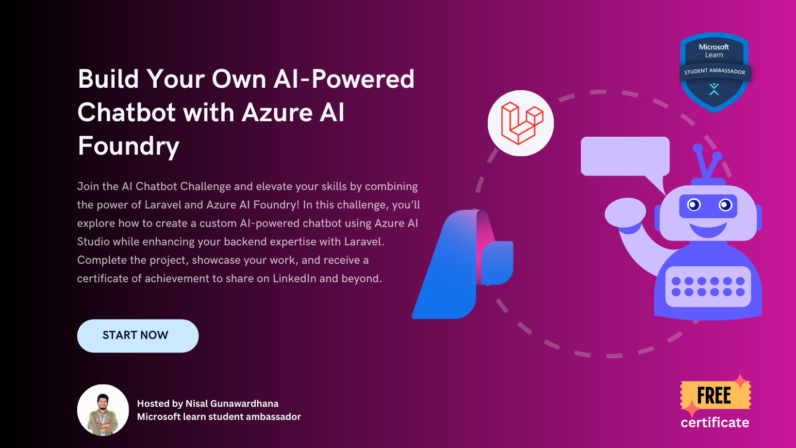
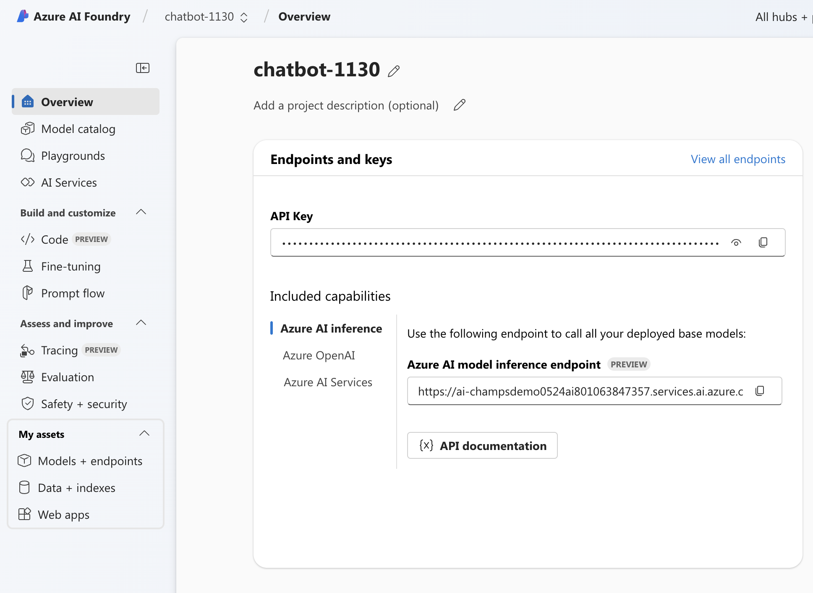

# Build Your Own AI-Powered Chatbot with Azure AI Foundry

## Description

Join the AI Chatbot Challenge and elevate your skills by combining the power of Laravel and Azure AI Foundry! In this challenge, you’ll explore how to create a custom AI-powered chatbot using Azure AI Studio while enhancing your backend expertise with Laravel. Complete the project, showcase your work, and receive a certificate of achievement to share on LinkedIn and beyond.


## Step 01
## Getting Started with Azure AI Foundry

First, start learning with Azure AI Foundry by completing the Azure AI Foundry learning path: [Create Custom Copilots with AI Studio](https://learn.microsoft.com/training/paths/create-custom-copilots-ai-studio?wt.mc_id=studentamb_365539)


## Step 02
## Setting Up the Chatbot

## How to Fork this Repository

To fork this repository, follow these steps:
1. Navigate to the repository on GitHub.
2. Click the "Fork" button in the top right corner of the page.
3. Choose your GitHub account to fork the repository.

## How to Clone to Local PC

To clone the forked repository to your local PC, follow these steps:
1. Open your terminal or command prompt.
2. Run the following command, replacing `your-username` with your GitHub username:
    ```bash
    git clone https://github.com/your-username/chatbot-By-NisalGunawardhana.git
    ```
3. Navigate to the cloned directory:
    ```bash
    cd chatbot-By-NisalGunawardhana
    ```
## Setting Up Environment Variables

    To set up your environment variables, follow these steps:

    1. Copy the `.env.example` file to create a new `.env` file:
        ```bash
        cp .env.example .env
        ```

    2. Open the `.env` file in your preferred text editor.

    3. Uncomment the `AZURE_URL` and `API_KEY` lines by removing the `#` at the beginning of the lines and provide the appropriate values:
        ```env
        AZURE_URL=your_azure_url
        API_KEY=your_api_key
        ```
  
## Finding Your Azure AI Studio API Key and Endpoint

    To find your Azure AI Studio API key and endpoint, follow these steps:

        1. Sign in to the [Azure AI Foundry](https://ai.azure.com/).
        2. Navigate to your Project.
        3. In the left-hand menu, select the "Overview" section.
        4. You will see your API keys and endpoint URL listed on this page. Copy these values to use in your `.env` file.

    

## Step 03
## Submit Project and Get Certificate

    After completing the project, submit it to receive your certificate. Follow these steps:

        1. Ensure you have completed the learning path and attached the completion badge.
        2. Enter your correct name and email address.
        3. Provide your LinkedIn profile URL.
        4. Include the link to your forked repository.

    Fill out the submission form here: [Google Form](https://forms.gle/your-google-form-link)


## Prerequisites

Before running the project, ensure you have the following installed:

- **Laravel**: A PHP framework for web artisans. [Laravel Documentation](https://laravel.com/docs)
    ```
## Helpful YouTube Videos for Setting Up Laravel

Here are some YouTube videos to help you with setting up a Laravel development environment:

- [How to Install Laravel on Windows](https://www.youtube.com/watch?v=MFh0Fd7BsjE)
- [How to Install Laravel on macOS](https://www.youtube.com/watch?v=4q0gYjAVonI)
- [How to Install Laravel on Ubuntu](https://www.youtube.com/watch?v=ImtZ5yENzgE)

- **PHP >= 8.0**: A popular general-purpose scripting language that is especially suited to web development. [PHP Documentation](https://www.php.net/docs.php)
- **Composer**: A dependency manager for PHP. [Composer Documentation](https://getcomposer.org/doc/)
- **Node.js & npm**: Node.js is a JavaScript runtime built on Chrome's V8 JavaScript engine, and npm is the package manager for Node.js. [Node.js Documentation](https://nodejs.org/en/docs/)
- **A web server like Xampp or Nginx**: Xampp is an easy-to-install Apache distribution containing MySQL, PHP, and Perl. Nginx is a high-performance HTTP server and reverse proxy. [Xampp Documentation](https://www.apachefriends.org/index.html) | [Nginx Documentation](https://nginx.org/en/docs/)

To set up the project, follow these steps:

1. **Install PHP**: Follow the instructions in the PHP documentation to install PHP on your system.
2. **Install Composer**: Download and install Composer by following the instructions in the Composer documentation.
3. **Install Node.js & npm**: Download and install Node.js, which includes npm, by following the instructions in the Node.js documentation.
4. **Set up a web server**: Install and configure a web server like Xampp or Nginx by following the respective documentation.

Once you have all the prerequisites installed, you can proceed with cloning the repository and setting up the environment variables as described in the previous sections.

## Helpful YouTube Videos for Installation

Here are some YouTube videos to help you with the installation process:

1. **Installing PHP on Windows/Mac/Linux**:
    - [How to Install PHP on Windows 10](https://www.youtube.com/watch?v=OK_JCtrrv-c)
    - [How to Install PHP on macOS](https://www.youtube.com/watch?v=y3hLXe0rfn4)
    - [How to Install PHP on Ubuntu](https://www.youtube.com/watch?v=K5n1k0p-5e0)

2. **Installing Composer**:
    - [How to Install Composer on Windows](https://www.youtube.com/watch?v=1K77xg8JH0Y)
    - [How to Install Composer on macOS](https://www.youtube.com/watch?v=Tf5jz4ZkGfw)
    - [How to Install Composer on Ubuntu](https://www.youtube.com/watch?v=8QnZ3QhUqXM)

3. **Installing Node.js and npm**:
    - [How to Install Node.js and npm on Windows](https://www.youtube.com/watch?v=kQabFyl9r9I)
    - [How to Install Node.js and npm on macOS](https://www.youtube.com/watch?v=Imj8PgG3bZU)
    - [How to Install Node.js and npm on Ubuntu](https://www.youtube.com/watch?v=kYtRSSpUduw)

4. **Setting Up a Web Server**:
    - [How to Install XAMPP on Windows](https://www.youtube.com/watch?v=h6DEDm7C37A)
    - [How to Install XAMPP on macOS](https://www.youtube.com/watch?v=CCENlDeGvv8&t=254s)
    - [How to Install Nginx on Ubuntu](https://www.youtube.com/watch?v=7YqlP7HYU1g)
## License

This project is licensed under the MIT License. You are free to use it for educational purposes.
The Laravel framework is open-sourced software licensed under the [MIT license](https://opensource.org/licenses/MIT).

## Follow Me

Stay connected and follow me on social media for updates and more:

- [GitHub](https://github.com/nisalgunawardhana)
- [Twitter](https://twitter.com/thenisas)
- [Facebook](https://web.facebook.com/thenisals/)
- [LinkedIn](https://www.linkedin.com/in/nisalgunawardhana/)